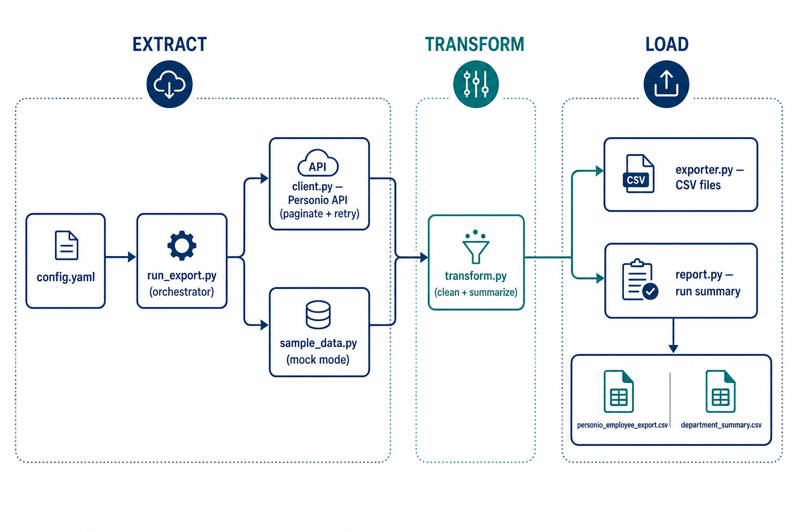
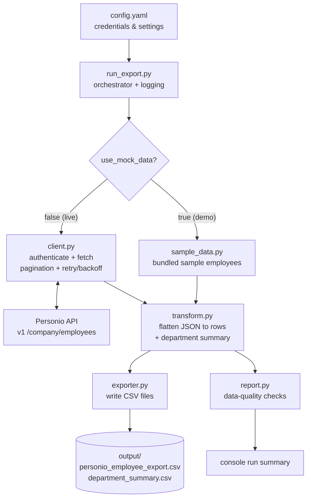

# Architecture

The tool is a small, single-purpose ETL pipeline. Each stage is one Python
module with a clear responsibility, which keeps it easy to read, test and hand
over to a customer.

The same pipeline as an editable Mermaid diagram:

## Stage responsibilities

| Stage | Module | Responsibility |
| --- | --- | --- |
| Configure | `config.py` | Load & validate `config.yaml`; keep secrets out of code. |
| **Extract** | `client.py` | Authenticate, then fetch all employees (paged, with retries). |
| (demo) | `sample_data.py` | Provide realistic sample data when there are no credentials. |
| **Transform** | `transform.py` | Flatten nested JSON into the CSV schema; build the department summary. |
| **Load** | `exporter.py` | Write the two CSV files to the output folder. |
| Report | `report.py` | Print a run summary and flag data-quality gaps. |
| Orchestrate | `run_export.py` | Wire the stages together, handle errors, set up logging. |

## Design choices worth highlighting

- **One responsibility per file** - easy for a customer or another engineer to follow.
- **Mock mode** - the exact same transform runs on sample data, so the tool can
  be demoed and tested with no credentials.
- **Built for scale** - pagination handles large companies (e.g. 2,000 employees);
  retries absorb rate limits and transient network errors.
- **Extensible "Load"** - today it writes CSV locally; delivering to SFTP or a BI
  landing zone means adding one function alongside `exporter.py`, nothing else changes.

## Key decisions & trade-offs

Every choice below was made to match the brief: *simple, robust, and safe to hand
to a customer who may not be technical.*

| Decision | Why | Trade-off accepted |
| --- | --- | --- |
| **v1 `/company/employees`** (not v2, not multiple endpoints) | One call returns master data, employment details and salary — everything the CSV needs. Fewer moving parts to explain and support. | v2 has a cleaner data model; if the customer needed absences/recruiting too, I'd add those endpoints behind the same client. |
| **Config file (YAML), not env vars or a UI** | Readable by non-technical users, easy to diff, keeps secrets out of code and git. | Slightly less "12-factor" than env vars; easy to switch later since config loading is isolated in `config.py`. |
| **CSV output to local disk first** | Exactly what the brief asked for; zero hosting; works with any downstream (payroll, BI, manual upload). | Delivery (SFTP/email/BI) is deliberately a separate, pluggable step — see roadmap. |
| **Salary normalised to annual gross** | Personio stores monthly *or* yearly per employee; a raw average would silently mix the two and mislead payroll. | The column no longer mirrors Personio 1:1, but it's documented and comparable — the right call for a *reporting* export. |
| **Currency captured; mixed-currency departments flagged** | A multi-country tenant may hold EUR and GBP salaries; averaging across them is meaningless. | The fixed CSV schema has no currency column, so we warn rather than change the schema; per-currency reporting is a follow-up. |
| **Mock mode built in** | Customer (or reviewer) succeeds on the first run with no credentials; the same transform code path is exercised. | A little extra code, but it doubles as a test fixture and a demo. |
| **Plain `requests` + `unittest`, no framework** | Lean, no heavy dependencies for a customer to vet or install. | No async/parallel paging; fine at 2,000 employees, revisit only if latency matters. |

## What I intentionally left out (and why)

Scope discipline is part of the answer. These were conscious "not yet" calls, not
oversights:

- **Document exports** - the brief mentions HR *documents* alongside data. Those
  come from a separate v1 documents endpoint and are a file-transfer concern, not a
  CSV one; I scoped this iteration to the required employee data. The same
  extract/load structure would host it (fetch document metadata, stream files to
  the chosen destination) as a clear next step.
- **SFTP / email / BI delivery** - the brief said "produce the CSV locally"; I kept
  delivery pluggable rather than half-building three transports.
- **A scheduler** - every OS already has one (cron / Task Scheduler); shipping our
  own would be more to maintain and explain.
- **Incremental sync** - a full daily export is simpler and correct for 2,000
  employees. `updated_since` is the obvious next step if volume grows.
- **A database / warehouse load** - out of scope for a payroll CSV, and easy to add
  as another "Load" target.

## Roadmap (how this grows with the customer)

This maps directly to how a real integration matures — useful talking points for
scaling the solution:

1. **Delivery targets** - add `sftp.py` / `email.py` alongside `exporter.py`; the
   pipeline calls them the same way it calls the CSV writer.
2. **Incremental exports** - use the API's `updated_since` filter to fetch only
   changed records, cutting run time and API load.
3. **Near-real-time** - subscribe to Personio **webhooks** so payroll updates are
   pushed on change instead of waiting for the daily batch.
4. **Richer datasets** - absences and recruiting via their v1/v2 endpoints, reusing
   the same client + transform pattern.
5. **iPaaS / no-code** - for customers on Workato, Make or Zapier, expose the same
   transform as a connector step so non-developers can wire it up.
6. **Observability** - structured (JSON) logs and a run-status file so the customer's
   ops tooling can alert on a failed export.
